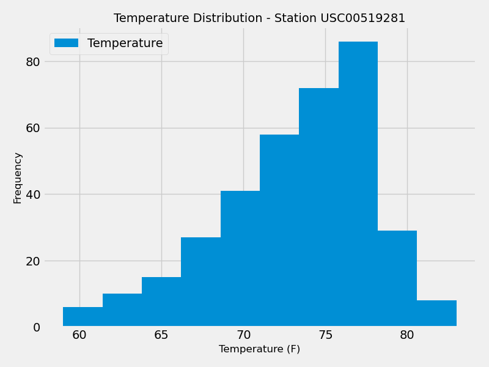

# Module 10 - SQLAlchemy & Flask Challenge
SQLAlchemy & Flask Challenge - Week 10 - Data Analytics Boot Camp - University of Oregon

## Part 1:  Analyze and Explore the Climate Data
Use Python and SQLAlchemy to do a basic climate analysis and data exploration of your climate database. Specifically, we'll use SQLAlchemy ORM queries, Pandas, and Matplotlib.

### Precipitation Analysis
Design a query to retrieve the last 12 months of precipitation data and plot the results.

### Station Analysis
Design a query to calculate the total number of stations and determine the most active station.  Then retrieve the last 12 months for that station and plot a histogram of all of the temperatures observed.

## Part 2:  Design A Climate App
Design a Flask API based on the queries developed in the previous section.

### API Routes
- /
    - Root.  Showing available API routes.

- /api/v1.0/precipitation
    - Returns precipitation data for the last 12 months in the dataset in JSON format.

- /api/v1.0/stations
    - Returns list of stations from dataset in JSON format.

- /api/v1.0/tobs
    - Returns minimum temperature, average temperature, and maximum temperature for a specified start date.

- /api/v1.0/&lt;start&gt;
    - Returns minimum temperature, average temperature, and maximum temperature for a specified start date.

- /api/v1.0/ &lt;start&gt;/&lt;end&gt;
    - Returns minimum temperature, average temperature, and maximum temperature for a specified start and end date.